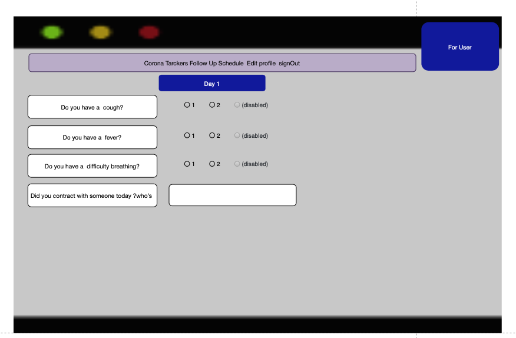
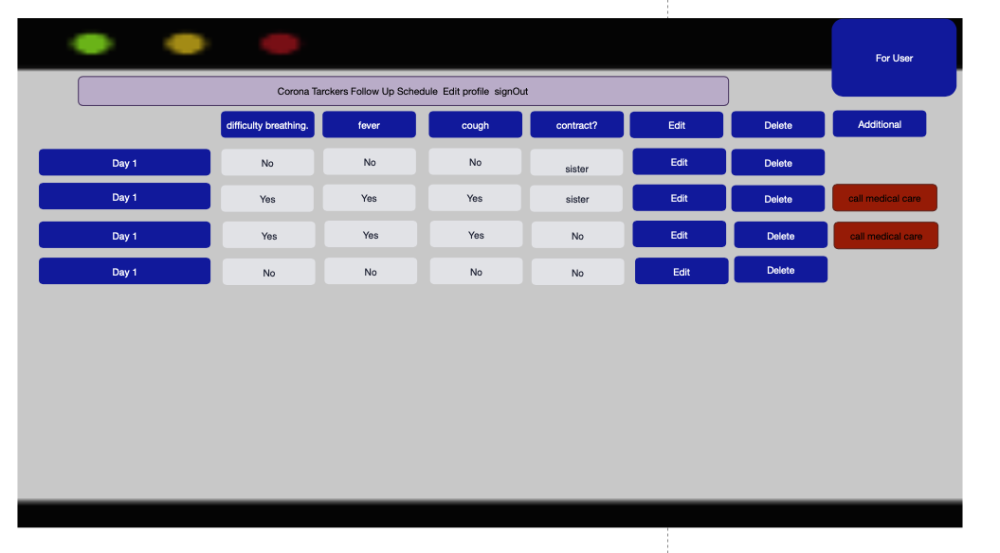
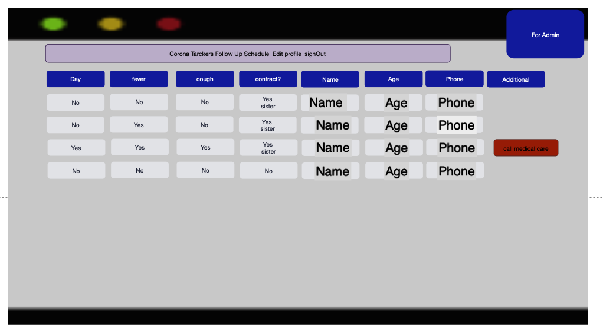
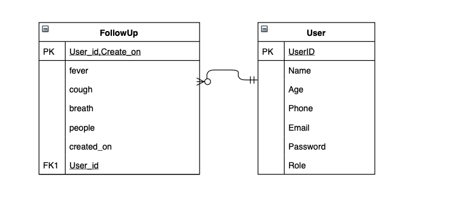
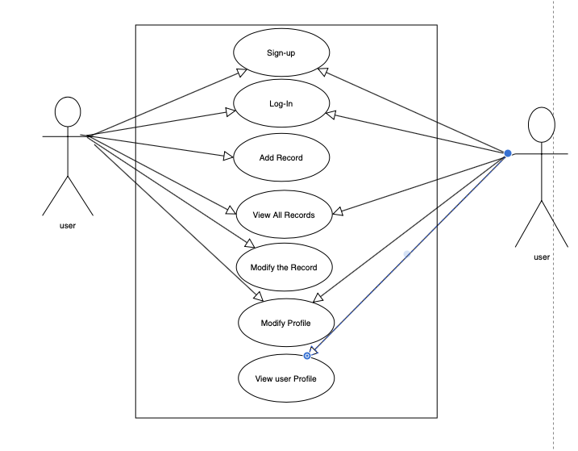

# CORONa TRACKER


# Project Title

Corona Virous Ttracker

# project Description:

Coronavirus disease (COVID-19) is an infectious disease caused by a new virus.
The disease causes illness (like the flu) with symptoms such as a cough, fever, difficulty breathing.and more . 

The symptoms my  showing up in people within 14 days of exposure to the virus.
The symptoms include:
* Fever
* Cough
* Shortness of breath or difficulty breathing

health care app trying to restrict people they may infected .
people who:
 - Recent travel.
 - residence in an area with ongoing community spread of COVID-19.
 - Close contact with someone who has COVID-19.
 
 The app save data for each user every day and Follows the temperature and other symptoms.
 there is other rol in this app (Admin or hospital) they can follow each user and symptoms and can view the information and call them if they need .
Wireframes: 





ERD:


Use case:


User Story:
As a user, I can SignUp.
As a user, I can sign in.
As a user, I can logout.
As a user, I can Edit my profile.
As a user, I can add  just one updated situation in each day.
As a user, I can  view all my situations.
As a user, I can Edit My situation.
As a user, I can Delete My situation.
As a system , I can display a Warning if the user have more than 3 Symptoms.
As an Admin, I can View all situations for each user.
As an Admin, I can View all user information To contact with them if it’s need.

### Technologies
Project is created with:
* Ruby version  => ruby 2.6.5
* Rails vaersion => Rails 5.2.4.2
* Data Base : postgres

* in gemfile we use
```
gem 'devise'
``` 
```
gem 'bootstrap', '~> 4.3.1'
```

* Explain the code :
[How this project build  ](steps.md)


* Deployment instructions
[Deploymnt with heroku](https://devcenter.heroku.com/articles/getting-started-with-rails5)

